# HowTo-Fuseki

This is a little tutorial how to install and run [Apache Jena Fuseki](https://jena.apache.org/documentation/fuseki2/index.html) on your local (windows) machine.

# Java:
If you have difficulties getting Fuseki to run check if you have a current Java version (JDK) installed on your computer. If not you can find it [here](https://www.oracle.com/java/technologies/downloads/).

# Installation

## Step 1: Download Fuseki

Go to the following link and download the current version of Fuseki. Make sure you download the right file (binary distribution of Fuseki)

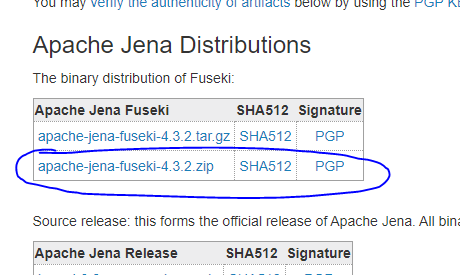

## Step 2: Unpack Fuseki

Unpack the zip-file in a meaningful directory on your local machine (best case scenario without spaces or Umlaute). For the purpose of this HowTo we assume that the directory is saved under "C:/Fuseki".

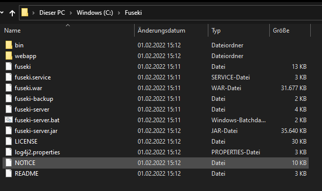

## Step 3: Open Windows console

Open the Windows Console by using the shortcut "Windows + R" and type in "cmd" in the prompt.
The console will open in a new window.

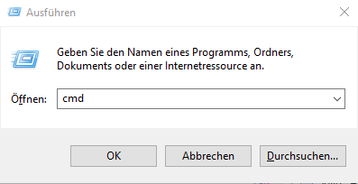

## Step 4: Change the working directory

In the console we want to change the working directory to the location of our Fuseki directory. Therefore we type in the console:

```
cd C:/Fuseki
```

"cd" stands for "change directory" and the console will use our new path now as working directory.

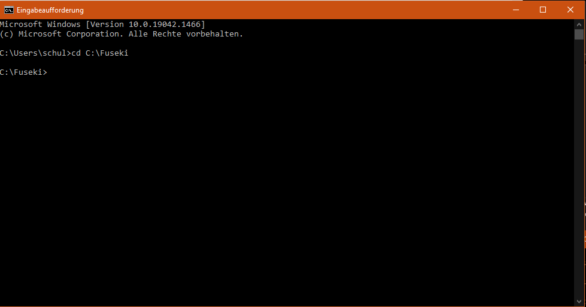

## Step 5: Run Fuseki

In our Fuseki directory is a file called "fuseki-server.bat". In order to start Fuseki we need to execute it via the console. Therefore, we type in our console

```
fuseki-server.bat
```

and the server will fire up. The console will print out on which Port the server gets started. Usually it uses the Port 3030.

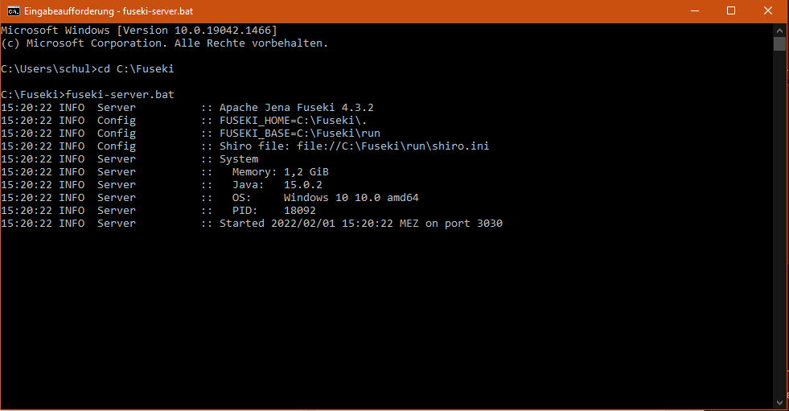

We can use this port to open up Fuseki in our webbrowser. Simply type "localhost:3030" in your browser.

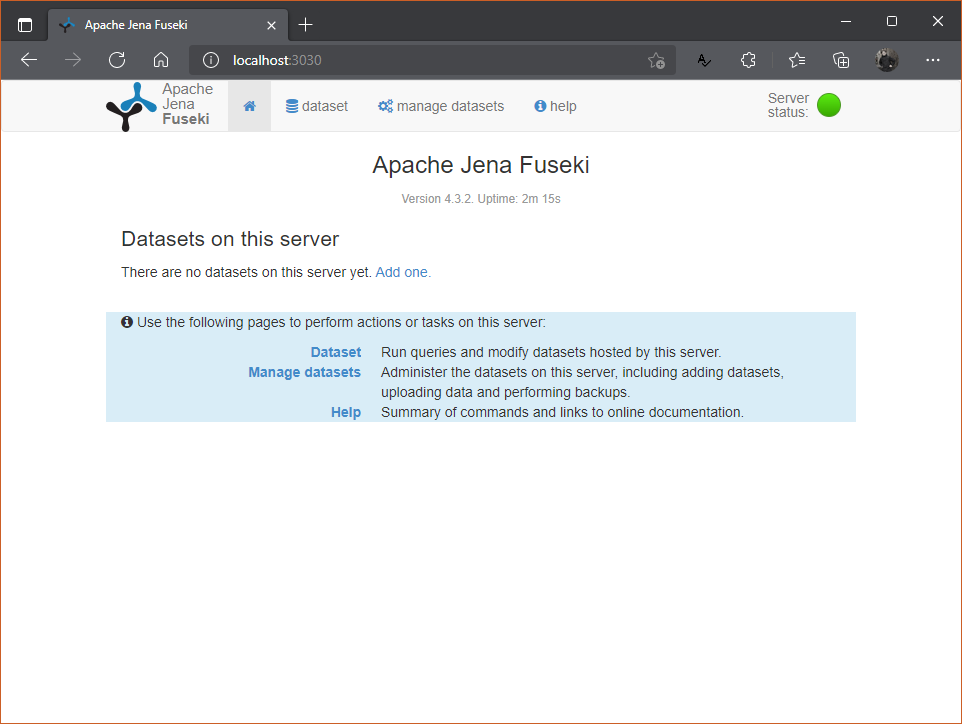

Congarts! Fuseki is now running on your local machine. You have to fire up the server every time you close the console or restart your device.

# Using Fuseki in the Browser

For this part we will use a little example dataset. We retrieved this dataset from the [W3C-Website](https://www.w3.org/TR/turtle/)

```
@base <http://example.org/> .
@prefix rdf: <http://www.w3.org/1999/02/22-rdf-syntax-ns#> .
@prefix rdfs: <http://www.w3.org/2000/01/rdf-schema#> .
@prefix foaf: <http://xmlns.com/foaf/0.1/> .
@prefix rel: <http://www.perceive.net/schemas/relationship/> .

<#green-goblin>
    rel:enemyOf <#spiderman> ;
    a foaf:Person ;    # in the context of the Marvel universe
    foaf:name "Green Goblin" .

<#spiderman>
    rel:enemyOf <#green-goblin> ;
    a foaf:Person ;
    foaf:name "Spiderman", "Человек-паук"@ru .

```

Copy the text to a text document and save it on your local machine and rename the file to "example.ttl"

## Step 6: Create a new dataset

With Fuseki opend in the browser, go to the tab "manage datasets" and select "add new dataset".
There you will have to give the new dataset a name and select a type. We will call the dataset "Example-Dataset" and select the type "TDB2)

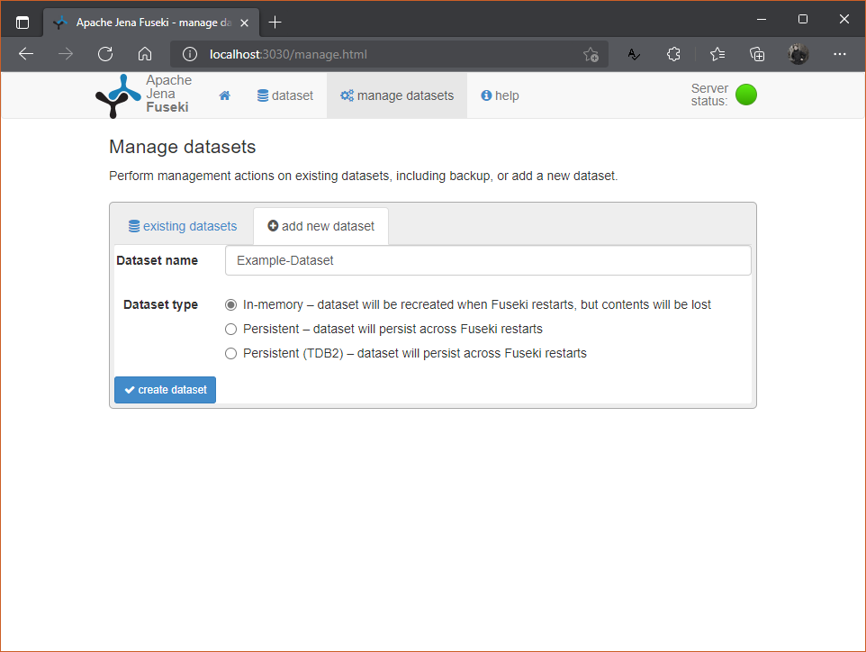

Next, click the "create dataset" button. It will now appear under the tab "existing datasets"

## Step 7: Add data to your dataset

Now we are going to upload the example file that we have created. Therefore, in the tab "existing datasets", under the category "manage datasets", we click on the button "upload data".

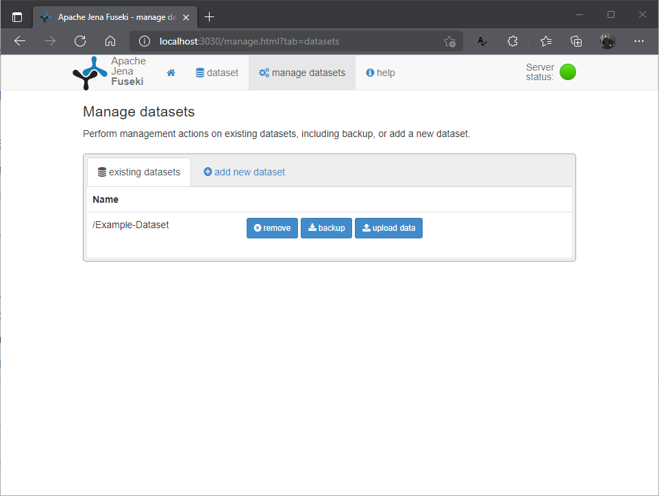

Now we upload our example file, either by clicking "select files", or by draging the file into the browser and dropping it on the "select files" button.

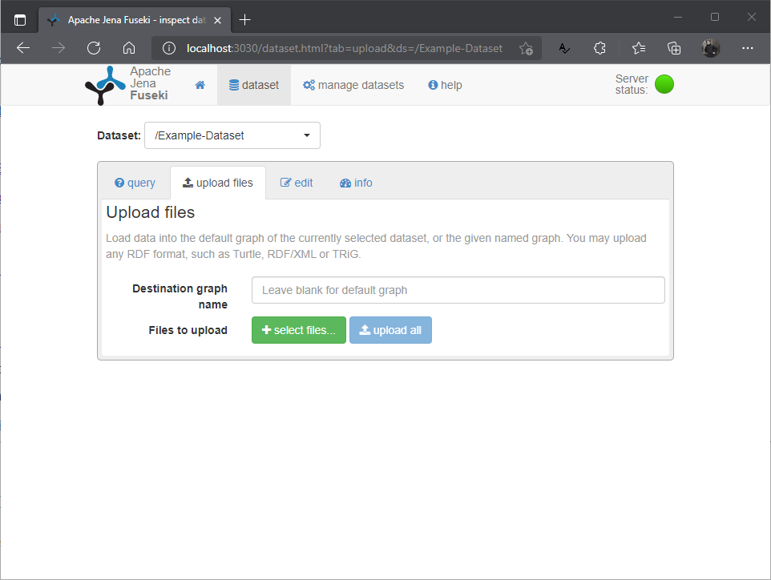

The file is not yet uploaded to the server. In order to upload it we have to click the "upload now" button.

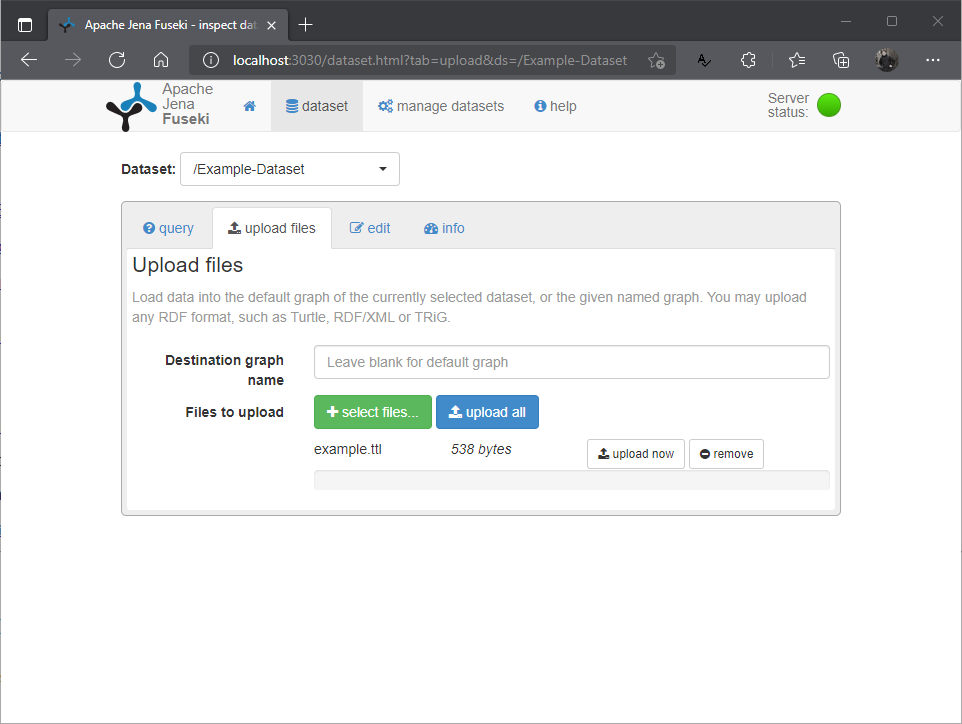

At this step fuseki will tell you if there were some maleformed triples in your file. Otherwise it will just return a "success" message.

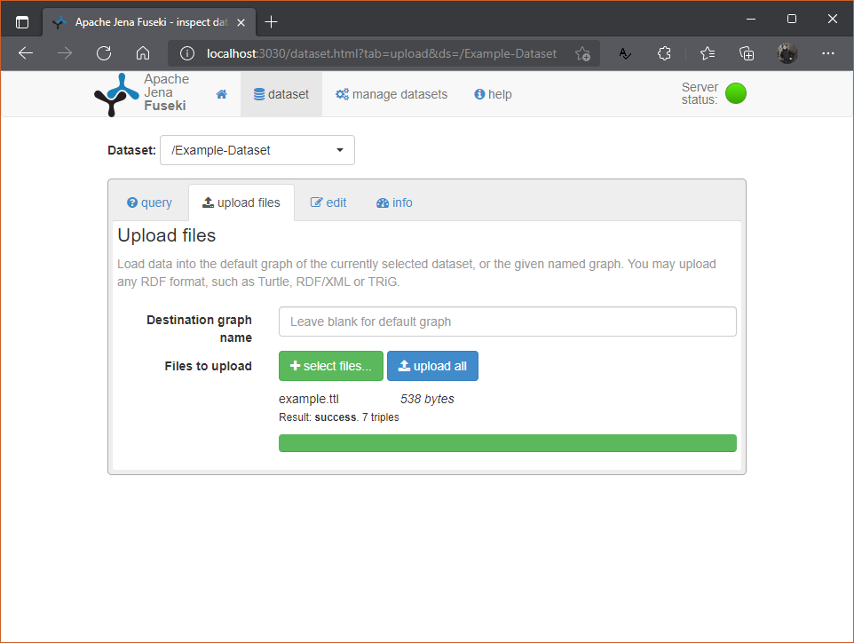

## Step 8: SPARQL queries

Now we can move on to the "dataset" tab where we can query our data using SPARQL. If you have multiple datasets on your server you can browse them via the dropdown menu on top of the page. An example query is already inserted into Fuseki an can be used to test it. just hit the little play button and inspect the results. For more advanced queries please consider the [W3C Recommondations](https://www.w3.org/TR/rdf-sparql-query/)

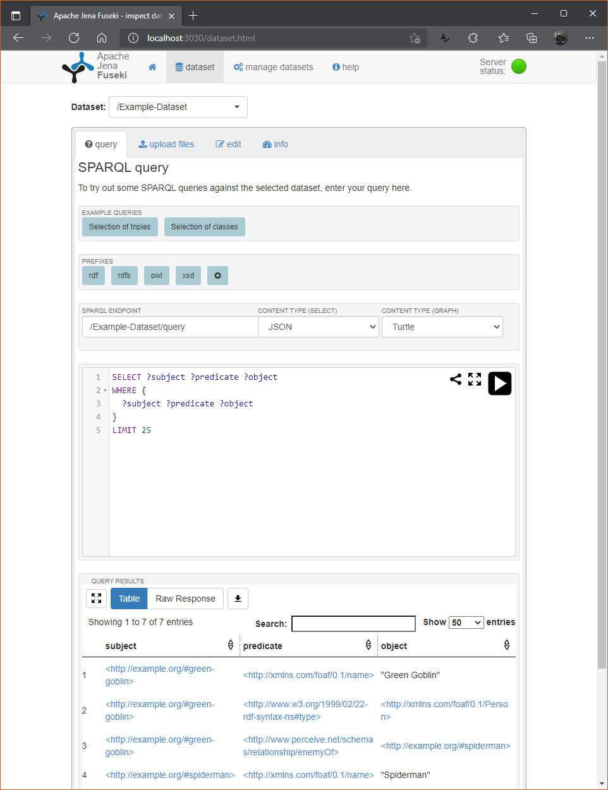

## Step 9: Using Fuseki with HTTP Requests

Instead of querying via the website, we can query the data on the datasets via the SPARQL endpoint of each dataset. This method is called "SPARQL over HTTP" or SOH and is documented on the [Fuseki Website](https://jena.apache.org/documentation/fuseki2/soh.html). For this HowTo we are using [Postman](https://www.postman.com/) to query the dataset but the same results can be achieved with Python, Javascript, etc...

In Postman we create a new HTTP GET request and enter the URL of our endpoint. For Fuseki this is in our example:

```
localhost:3030/Example-Dataset/query
```

In the "Params" tab of postman we can attach our query by setting a key and a value. The key for our parameter is "query" and the value is our SPARQL query:

```
SELECT ?subject ?predicate ?object
WHERE {
  ?subject ?predicate ?object
}
LIMIT 25
```

You can see in Postman how this information is getting attached to our URL.
As soon as we hit the "sent" button we get the results of our query returned in a JSON response.

If we want to create new data on our Dataset using SPARQL we would need to exchange "query" with "update"

Fun fact: You can copy the URL with the query to the browser and see the results on a webpage.

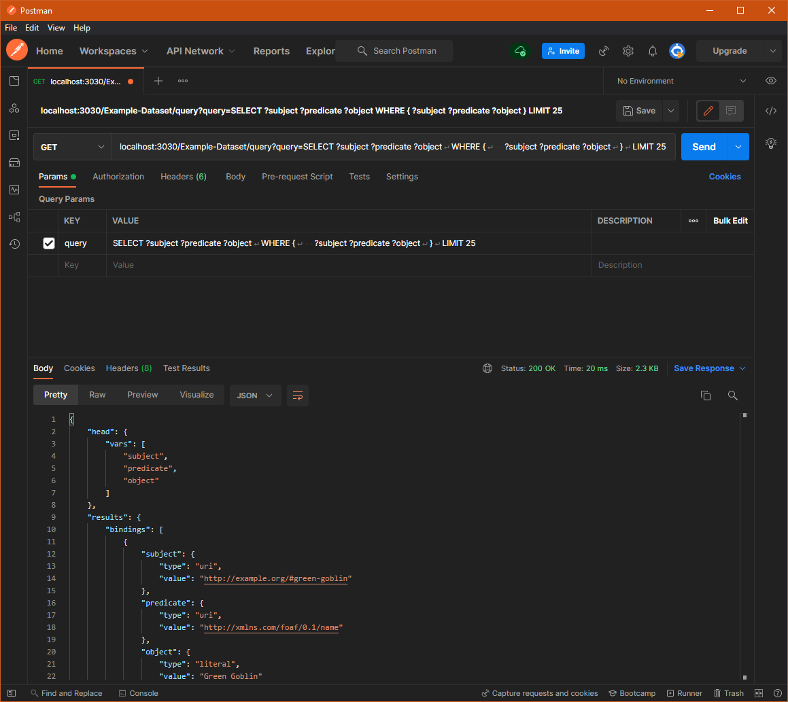

Postman can also generate us code snippets that show us how to achieve the same results with different programming languages and modules. When you click on the right hand side on the little code symbol "</>" you can select a language and a module and Postman will show you how this request is written in that language.


